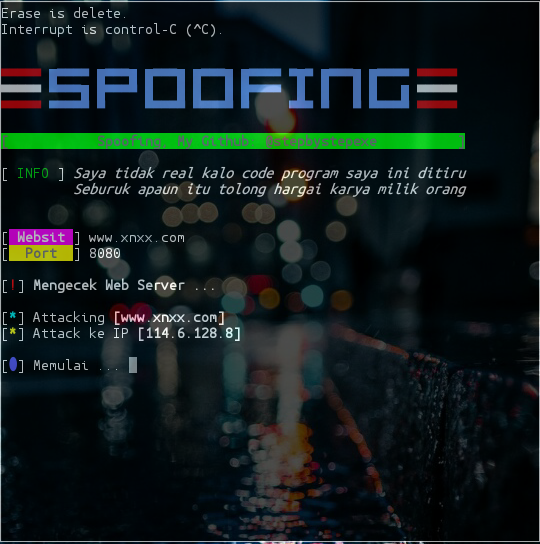

# Spoofing:
*Spoofing merupakan Teknik yang digunakan untuk memperoleh akses yang tidak sah ke suatu komputer , informasi, atau suatu jejaring sosial, dimana penyerang berpura-pura memalsukan bahwa mereka adalah host yang dapat dipercaya atau host pemilik sebenarnya , biasanya hal ini dilakukan oleh seorang peretas.*
#### Screenshot:

#### Cara Menginstall:
```
pkg update && pkg upgrade
apt-get install git
apt-get install python2
git clone https://github.com/stepbystepexe/Spoofing
cd Spoofing
ls
python2 spoofing.py
```
#### Kontak:
+ Email  d_q16x@outlook.co.id
+ WhatsApp https://tinyurl.com/wel4alo
#### Paypal:
+ Onclick https://bit.ly/3dcEQcN
#### LiberaPay:
<noscript><a href="https://liberapay.com/stepbystepexe/donate"></a></noscript>
>**Created by Nedi Senja**
